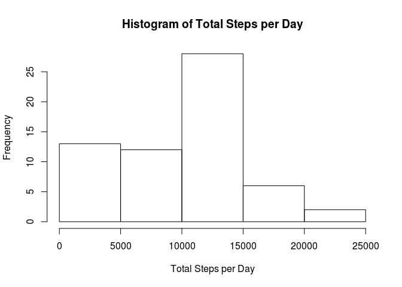
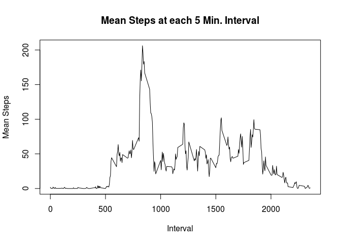
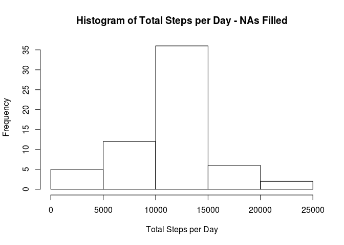
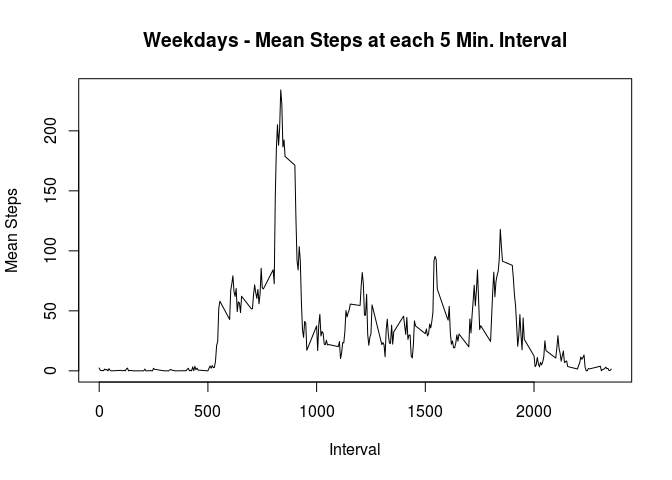
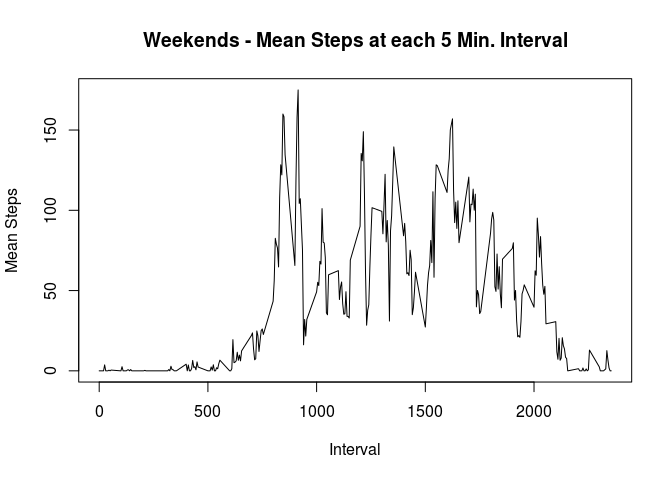

# Reproducible Research: Peer Assessment 1
Bill Webb  


## Loading and preprocessing the data

First, we unzip the data file and then load the data into a local data frame.


```r
unzip("activity.zip", overwrite=TRUE)
activityData <- read.csv("activity.csv")
activityPerDay <- split(activityData, as.Date(activityData$date))
```


## What is mean total number of steps taken per day?

First, calculate the total steps per day and display a histogram, ignoring all NA values.


```r
sumStepsPerDayList <- lapply(activityPerDay, function(day) sum(day$steps, na.rm=TRUE))
sumStepsPerDay <- data.frame(cbind(names(sumStepsPerDayList)), as.numeric(matrix(unlist(sumStepsPerDayList))))
colnames(sumStepsPerDay) <- c("date", "sumSteps")
class(sumStepsPerDay$date) <- "Date"
hist(sumStepsPerDay$sumSteps, xlab="Total Steps per Day", main="Histogram of Total Steps per Day")
```

 

The mean number of steps per day is:


```r
mean(sumStepsPerDay$sumSteps)
```

```
## [1] 9354.23
```

The median number of steps per day is:


```r
median(sumStepsPerDay$sumSteps)
```

```
## [1] 10395
```

## What is the average daily activity pattern?

Make the interval a factor, split on factor and calculate the average for each factor.


```r
intervalMean <- aggregate( steps ~ interval, activityData, mean, na.action = na.omit)
colnames(intervalMean)[2]<- "meanSteps"
plot(intervalMean$interval, intervalMean$meanSteps, type="l", xlab="Interval", ylab="Mean Steps", main="Mean Steps at each 5 Min. Interval")
```

 

The interval with the highest mean steps is calculated as follows:


```r
intervalMean[which.max( intervalMean$meanSteps ),]
```

```
##     interval meanSteps
## 104      835  206.1698
```

## Imputing missing values

The total number of missing values in the dataset is:


```r
sum(is.na(activityData$steps))
```

```
## [1] 2304
```

Create a new dataset with the NAs replaced with the mean for the interval:


```r
activityDataFilled <- activityData
for(i in 1:nrow(activityDataFilled)){
   if( is.na(activityDataFilled$steps[i]) == TRUE){
       activityDataFilled$steps[i] <- intervalMean[intervalMean$interval == activityDataFilled$interval[i], 2]
   }
  }
```

An updated histograms is:


```r
activityPerDayFilled <- split(activityDataFilled, as.Date(activityDataFilled$date))
sumStepsPerDayListFilled <- lapply(activityPerDayFilled, function(day) sum(day$steps, na.rm=TRUE))
sumStepsPerDayFilled <- data.frame(cbind(names(sumStepsPerDayListFilled)), as.numeric(matrix(unlist(sumStepsPerDayListFilled))))
colnames(sumStepsPerDayFilled) <- c("date", "sumSteps")
class(sumStepsPerDayFilled$date) <- "Date"
hist(sumStepsPerDayFilled$sumSteps, xlab="Total Steps per Day", main="Histogram of Total Steps per Day - NAs Filled")
```

 

The updated mean number of steps per day is:


```r
mean(sumStepsPerDayFilled$sumSteps)
```

```
## [1] 10766.19
```

The updated median number of steps per day is:


```r
median(sumStepsPerDayFilled$sumSteps)
```

```
## [1] 10766.19
```

The results are more balanced, with a histogram more forming a bell curve and the mean and median converging.

## Are there differences in activity patterns between weekdays and weekends?

Add a factor to the activity data and split weekday and weekend data:


```r
activityDataWE <- activityData
activityDataWE$WE <- weekdays(as.Date(activityDataWE$date)) %in% c("Saturday","Sunday")
weSplit <- split(activityDataWE, activityDataWE$WE)
```

Plot both weekday and weekend data.  The step activity on the weekends looks at lot more random than during the weekdays.  This is likely consistent with someone who follows a regular routine at work or school during the week but does different, varying activities on the weekends.


```r
weekday <- aggregate( steps ~ interval, weSplit[[1]], mean, na.action = na.omit)
colnames(weekday)[2]<- "meanSteps"
weekend <- aggregate( steps ~ interval, weSplit[[2]], mean, na.action = na.omit)
colnames(weekend)[2]<- "meanSteps"

plot(weekday$interval, weekday$meanSteps, type="l", xlab="Interval", ylab="Mean Steps", main="Weekdays - Mean Steps at each 5 Min. Interval")
```

 

```r
plot(weekend$interval, weekend$meanSteps, type="l", xlab="Interval", ylab="Mean Steps", main="Weekends - Mean Steps at each 5 Min. Interval")
```

 
